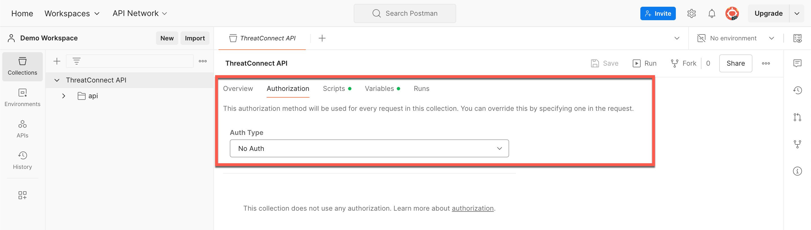
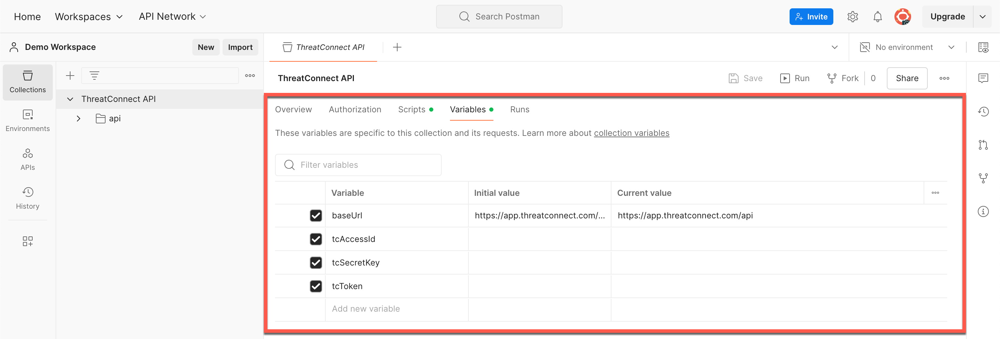
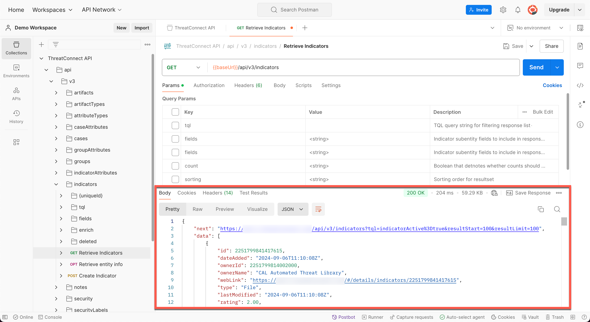

Postman Configuration
=====================

ThreatConnect® offers a v3 API `collection <https://learning.postman.com/docs/collections/collections-overview/>`_ that you can fork or import into Postman®. This page details how to fork and import the ThreatConnect v3 API collection, configure the collection's variables, and make an API request using the collection.

Step 1: Fork or Import the ThreatConnect v3 API Collection
----------------------------------------------------------

Navigate to the `ThreatConnect v3 API Postman collection <https://www.postman.com/threatconnect-api-dev/workspace/threatconnect-v3-api/overview>`_ and perform one of the following actions:

* `Fork the collection <https://learning.postman.com/docs/collaborating-in-postman/using-version-control/forking-entities/#creating-a-fork>`_
* `Export the collection <https://learning.postman.com/docs/getting-started/importing-and-exporting/exporting-data/#exporting-collections>`_ and then `import it <https://learning.postman.com/docs/getting-started/importing-and-exporting/importing-data/>`_ into Postman

Step 2: Configure the ThreatConnect v3 API Collection
-----------------------------------------------------

1.	Select **Collections** in the Postman `sidebar <https://learning.postman.com/docs/getting-started/basics/navigating-postman/#sidebar>`_. Then select the **ThreatConnect API** collection that was either forked or imported into your workspace to open a **ThreatConnect API** tab in the Postman `workbench <https://learning.postman.com/docs/getting-started/basics/navigating-postman/#workbench>`_.
2.	Select the **Authorization** subtab in the **ThreatConnect API** tab. Then select **No Auth** in the **Auth Type** dropdown, as the collection's pre-request script will perform all steps in the authentication process (Figure 1).

    Figure 1

3.	Select the **Variables** subtab in the **ThreatConnect API** tab to view the collection's variables (Figure 2). The ThreatConnect API supports `hash-based message authentication code (HMAC) <#hmac-authentication>`_ and `token authentication <#token-based-authentication>`_. Based on the type of authentication you will be using, fill out the corresponding variables, as detailed in the following sections.

    Figure 2

4.	Click **Save** at the top right of the **ThreatConnect API** tab to save your changes to the collection.

.. attention::
    If you enter an API token in addition to your ThreatConnect Access ID and Secret Key, token authentication will be used instead of HMAC authentication. However, if your token expires and you do not update the value for the **tcToken** variable or clear its checkbox, token authentication will still be used instead of HMAC authentication. Therefore, **it is recommended to use one authentication method only**.

HMAC Authentication
^^^^^^^^^^^^^^^^^^^

- **baseUrl**: Enter the base URL for your ThreatConnect instance (e.g., ``https://companyabc.threatconnect.com``). Do not include a trailing slash when entering the base URL.
- **tcAccessId**: Enter the Access ID for your `ThreatConnect API user account <https://knowledge.threatconnect.com/docs/creating-user-accounts>`_ in the **CURRENT VALUE** column.
- **tcSecretKey**: Enter the Secret Key for your ThreatConnect API user account in the **CURRENT VALUE** column.
- **tcToken**: Clear the checkbox for this variable.

Token-Based Authentication
^^^^^^^^^^^^^^^^^^^^^^^^^^

- **baseUrl**: Enter the base URL for your ThreatConnect instance (e.g., ``https://companyabc.threatconnect.com/api``). Do not include a trailing slash when entering the base URL.
- **tcAccessId**: Clear the checkbox for this variable.
- **tcSecretKey**: Clear the checkbox for this variable.
- **tcToken**: Enter your ThreatConnect API user account token in the **CURRENT VALUE** column. API user account tokens are generated on the **Membership** tab of the **Organization Settings** screen in ThreatConnect and expire after a set amount of time configured by your Organization Administrator. For instructions on creating an API token for your API user account, see the `"Authentication" section of the Quick Start page <https://docs.threatconnect.com/en/latest/rest_api/quick_start.html#authentication>`_.

Step 3: Make a ThreatConnect API Request in Postman
---------------------------------------------------

1.	Expand the following folders on the **Collections** tab in the Postman `sidebar <https://learning.postman.com/docs/getting-started/basics/navigating-postman/#sidebar>`_: **ThreatConnect API** > **api** > **v3**.
2.	Expand an endpoint's folder in the **v3** folder to view all available requests for the endpoint.
3.	Select an API request from the endpoint's folder to open the request in the Postman `workbench <https://learning.postman.com/docs/getting-started/basics/navigating-postman/#workbench>`_.
4.	Configure your request as desired using the **Query Params** and, for POST and PUT requests, **Body** subtabs in the top portion of the request's tab, and then click **Send** to the right of the request URL. If you connected successfully to the ThreatConnect API, response data will be displayed in the **Body** subtab in the bottom portion of the request's tab (Figure 3).

    Figure 3

You're now ready to use the ThreatConnect API collection in Postman. To learn more about each endpoint in v3 of the ThreatConnect API, select an endpoint under the `v3 API <https://docs.threatconnect.com/en/latest/rest_api/rest_api.html#v3-api>`_ section of this documentation.

Optional: Create Environments in Postman
----------------------------------------

If you use multiple ThreatConnect instances, it can be helpful to `create an environment <https://learning.postman.com/docs/sending-requests/managing-environments/#creating-environments>`_ for each instance with the `variables included in this collection <#step-2-configure-the-threatconnect-v3-api-collection>`_ via the **Environments** tab in the Postman sidebar. After you create an environment for each of your ThreatConnect instances, `select the environment <https://learning.postman.com/docs/sending-requests/managing-environments/#selecting-an-active-environment>`_ from the **Environment** at the top right of Postman before `making API requests <#step-3-make-threatconnect-api-requests-in-postman>`_.

----

*Postman® is a registered trademark of Postman, Inc.*