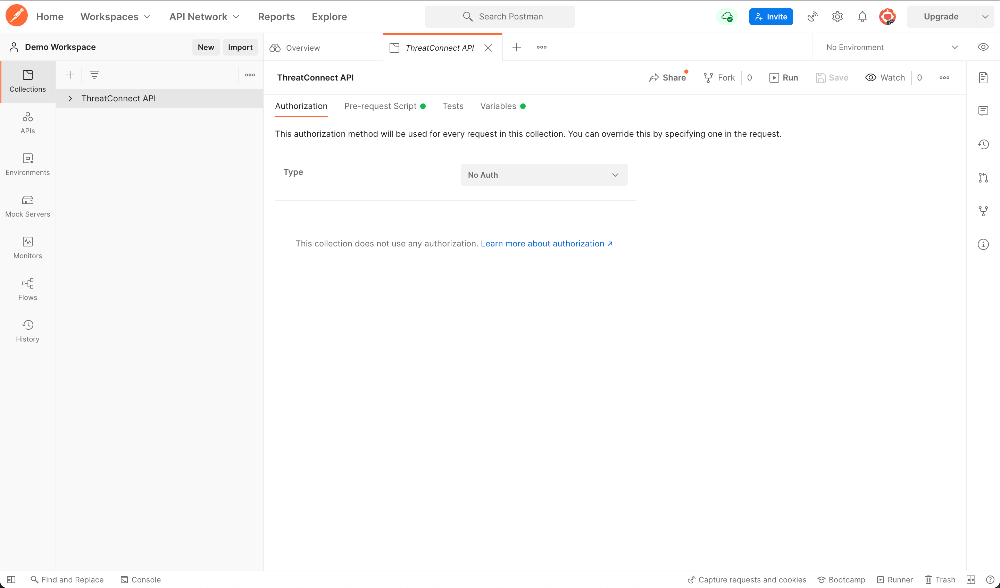
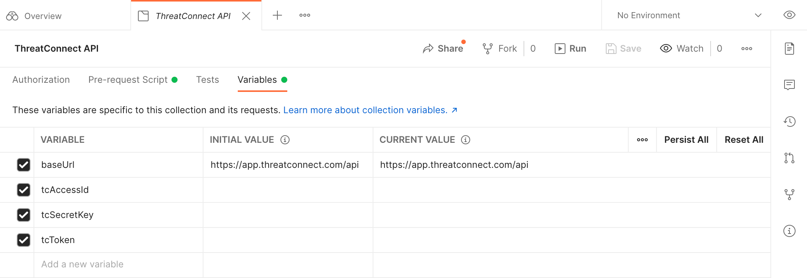
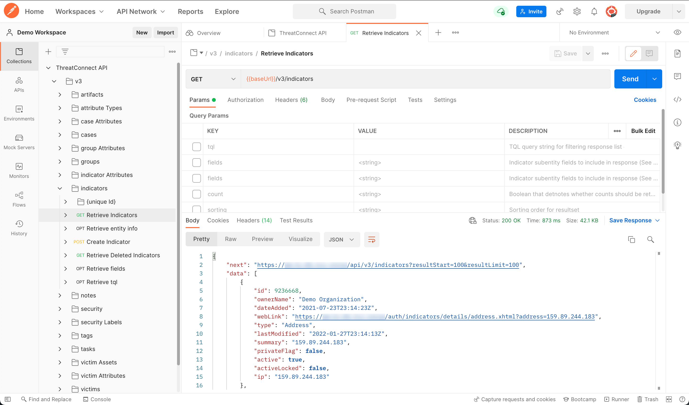

Postman Configuration
=====================

ThreatConnect® offers a v3 API collection that you can fork or import into Postman®. This page details how to fork and import the ThreatConnect v3 API collection, configure the collection's variables, and make an API request using the collection.

Step 1: Fork or Import the ThreatConnect v3 API Collection
----------------------------------------------------------

Navigate to the `ThreatConnect v3 API Postman collection <https://www.postman.com/threatconnect-api-dev/workspace/threatconnect-v3-api/overview>`_ and perform one of the following actions:

* `Fork the collection <https://learning.postman.com/docs/collaborating-in-postman/using-version-control/forking-entities/#creating-a-fork>`_
* `Export the collection <https://learning.postman.com/docs/getting-started/importing-and-exporting/exporting-data/#exporting-collections>`_ and then `import it <https://learning.postman.com/docs/getting-started/importing-and-exporting/importing-data/>`_ into Postman

Step 2: Configure the ThreatConnect v3 API Collection
-----------------------------------------------------

On the **Collections** tab, select the **ThreatConnect API** collection that was either forked or imported into your workspace. A **ThreatConnect API** tab will open with the **Authentication** subtab selected (Figure 1).

    Figure 4

Leave the authentication type set to **No Auth**, as the pre-request script included in the collection will perform all steps necessary for the authentication process.

Select the **Variables** subtab to display the variables in the **ThreatConnect API** collection (Figure 2).

    Figure 5

The ThreatConnect API supports `hash-based message authentication code (HMAC) <#hmac-authentication>`_ and `token-based authentication <#token-based-authentication>`_. Based on the type of authentication you will be using, fill out the corresponding variables as detailed in the following sections.

.. attention::
    If you enter an API token in addition to your ThreatConnect Access ID and Secret Key, token-based authentication will be used instead of HMAC authentication. However, if your token expires and you do not update the value for the **tcToken** variable, or clear its checkbox, token-based authentication will still be used instead of HMAC authentication. Therefore, **it is recommended to use one authentication method only**.

HMAC Authentication
^^^^^^^^^^^^^^^^^^^

- **baseUrl**: By default, this variable is set to the API URL for ThreatConnect's Public Cloud instance. If you are using an On-Premises or Dedicated Cloud ThreatConnect instance, enter the API URL for your instance (e.g., ``https://companyabc.threatconnect.com/api``).
- **tcAccessId**: Enter the Access ID for your `ThreatConnect API user account <https://training.threatconnect.com/learn/article/creating-user-accounts-kb-article>`_ in the **CURRENT VALUE** column.
- **tcSecretKey**: Enter the Secret Key for your ThreatConnect API user account in the **CURRENT VALUE** column.
- **tcToken**: Clear the checkbox for this variable.
- Click the **Save** button in the top toolbar of the **ThreatConnect API** tab.

Token-based Authentication
^^^^^^^^^^^^^^^^^^^^^^^^^^

- **baseUrl**: By default, this variable is set to the API URL for ThreatConnect's Public Cloud instance. If you are using an On-Premises or Dedicated Cloud ThreatConnect instance, enter the API URL for your instance (e.g., ``https://companyabc.threatconnect.com/api``).
- **tcAccessId**: Clear the checkbox for this variable.
- **tcSecretKey**: Clear the checkbox for this variable.
- **tcToken**: Enter a ThreatConnect API token created by your Organization Administrator in the **CURRENT VALUE** column.
- Click the **Save** button in the top toolbar of the ThreatConnect API tab.

.. attention::
    ThreatConnect API tokens **expire automatically after four hours**. To obtain a new API token, contact your Organization Administrator. Instructions for creating an API token are available in the “API Token” section of *ThreatConnect Organization Administration Guide*.

Step 3: Make ThreatConnect API Requests in Postman
--------------------------------------------------

1. Expand the **ThreatConnect API** collection on the **Collections** tab to display a **v3** folder.
2. Expand the **v3** folder to view folders for each endpoint in v3 of ThreatConnect's API.
3. Expand an endpoint's folder (**indicators** in this example) to view available requests for the endpoint.
4. Select an API request from the endpoint's folder (**GET Retrieve Indicators** in this example). A new tab will be opened for the selected API request.
5. Click the **Send** button to the right of the request URL. If you connected successfully to the ThreatConnect API, response data will be displayed in the lower pane of the tab for the API request (Figure 3).

    Figure 6

You're now ready to use the ThreatConnect API collection in Postman. To learn more about each endpoint in v3 of the ThreatConnect API, select an endpoint under the `v3 API <https://docs.threatconnect.com/en/latest/rest_api/rest_api.html#v3-api>`_ section of this documentation.

Optional: Create Environments in Postman
----------------------------------------

If you use multiple ThreatConnect instances, it can be helpful to `create an environment <https://learning.postman.com/docs/sending-requests/managing-environments/#creating-environments>`_ for each instance with the `variables included in this collection <#step-2-configure-the-threatconnect-v3-api-collection>`_ via the **Environments** tab on the side navigation bar. Once you have created environments for each ThreatConnect instance you access, `select the environment <https://learning.postman.com/docs/sending-requests/managing-environments/#selecting-an-active-environment>`_ from the **Environment** dropdown when `making API requests in Postman <#step-3-make-threatconnect-api-requests-in-postman>`_.

----

*Postman® is a trademark of Postman, Inc.*